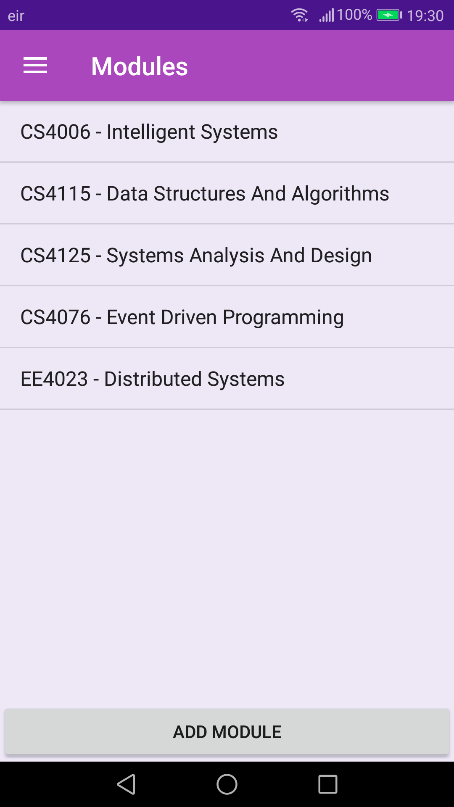
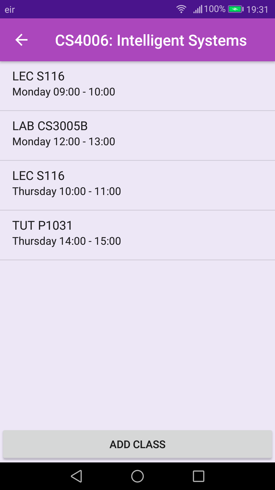
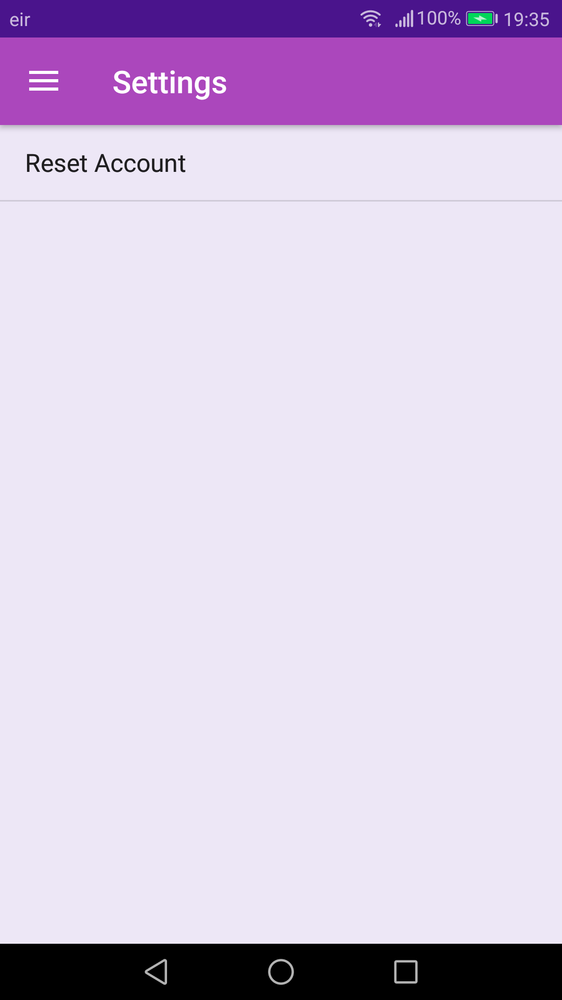

# StudentTimetableUL

## About
My first time developing an Android application, this project was developed for the Mobile Application Development module undertaken in my second year at UL. The application was created for University of Limerick student and allows students, using their student number, to retrieve their timetable and view, edit and add to it on their mobile phone. The application will also notify the student 15 minutes before each class and display the details of that class.

Unfortunately, the application no longer works due to the UL timetable site being recently revamped. 

## What I worked on

  #### Benjamin Grimes:
   - AddClassActivity.java
   - activity_add_class.xml
   - AddModule.java 
   - activity_add_module.xml
   - AlertReceiver.java
   - Assignments.java
   - fragment_assignments.xml
   - ClassDetailsActivity.java 
   - activity_class_details.xml
   - EditClassDetailsActivity.java 
   - activity_edit_class_details.xml
   - Home.java 
   - fragment_home.xml
   - LoadActivity.java
   - activity_load.xml
   - MainActivity.java
   - activity_main.xml
   - ModuleClassesActivity.java
   - actvity_module_classes.xml
   - Modules.java
   - fragment_modules.xml
   - Nav.java & activity_nav.xml
   - app_bar_nav.xml
   - content_nav.xml
   - nav_header_bav.xml
   - NotificationHelper.java
   - Settings.java
   - fragment_settings.xml
   - TimePickerFragment.java
   - Timetable.java
   - fragment_timetable.xml
   - TimetableDatabaseContract.java
   - TimetableDatabaseHelper.java
    
  #### Work done by other members:
   - AddAssignment.java
   - activity_add_assignment.xml
   - AssignmentDetailsActivity.java
   - activity_assignment_details.xml
   - Assignments.java
   - fragment_assignments.xml
   - EditAssignmentDetails.java
   - activity_edit_assignment_details.xml
   - TimetableDatabaseContract.java
   - TimetableDatabaseHelper.java

## Screenshots of the Application

###### Login screen

###### Home screen

###### Sidebar

###### Timetable screen

###### Modules screen

###### Module classes screen

###### Add module screen

###### Class details screen

###### Add class screen

###### Edit class details screen

###### Class notification

###### Settings screen

